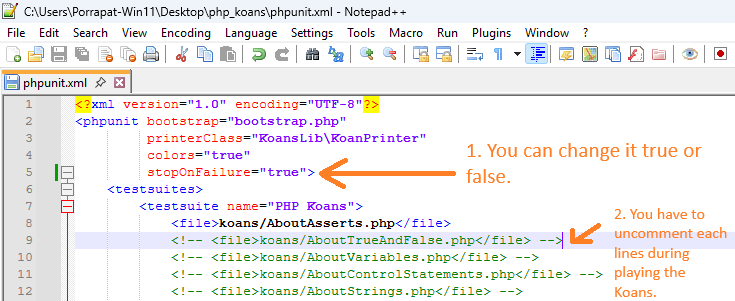
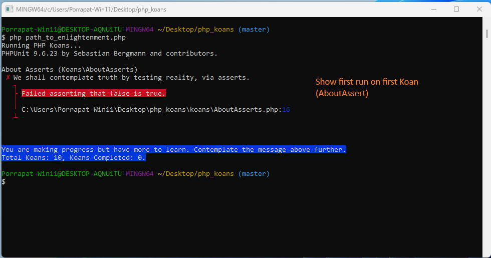

# PHP Koans

The **PHP Koans** walk you along the path to enlightenment in order to learn PHP.  
The goal is to learn the PHP language, syntax, structure, and some common functions and libraries.  
We also teach you culture by basing the koans on tests.  
Testing is not just something we pay lip service to, but something we live.  
Testing is essential in your quest to learn and do great things in PHP.

> _This project is inspired by Ruby Koans._

## 🌐 Available Languages

- 🇺🇸 [English](readme.md)
- 🇹🇭 [ภาษาไทย](readme_th.md)

## Inspiration Repos

The following repositories inspired this project:

- [Ruby Koans](https://github.com/edgecase/ruby_koans)
- [Python Koans](https://github.com/gregmalcolm/python_koans)
- [PHP Koans (by Akoebbe)](https://github.com/akoebbe/php_koans.git)
- [PHP Koans (by IvanSolaDelgado)](https://github.com/540/php_koans.git)
- [Rustlings](https://github.com/rust-lang/rustlings)
- [Rust Koans (by crazymykl)](https://github.com/crazymykl/rust-koans)

---

## Installing PHP

If you do not have **PHP** and **Composer** set up, please visit [php.net](https://www.php.net) for OS-specific installation instructions.  
To run the koans, you need **PHP** and **Composer** installed.

To verify your installation:

### On Unix/Linux/macOS/Windows (from any terminal window):

```bash
php -v
composer --version
```

### Get Started:

Look at phpunit.xml and then uncomment each test. You can start from `AboutAsserts`. These images below shows how to do it.

```bash
git clone https://github.com/Porrapat/php_koans.git
cd php_koans
composer install
php path_to_enlightenment.php
```

1. Setup Koans


2. Config Koans



3. Run Koans



4. Do Koans


5. Review Koans


### Other Stuff

**Author**: Porrapat Petchdamrongskul <<porrapat.cpe20@gmail.com>>  
**Powered by**: GeeGee a.k.a ChatGPT 😄  
**Issue Tracker**: [GitHub Issues](https://github.com/Porrapat/php_koans/issues)  
**Requirements**: PHP 7.4.x or later and Composer (any recent version)

---

### Other Command To Run Koans

```bash
composer test       # modern PHP style
php artisan test    # Laravel-style
php spark test      # CodeIgniter 4-style
```

### Tips & Tricks – Watching Koans Automatically

Just run this command, it will use Rust built binary to watch folder /koans and file phpunit.xml

```bash
composer watch                  # run command
```

### License

[](https://opensource.org/licenses/MIT)
