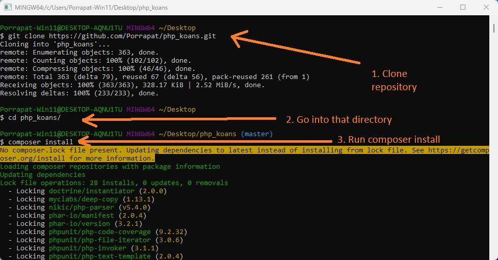
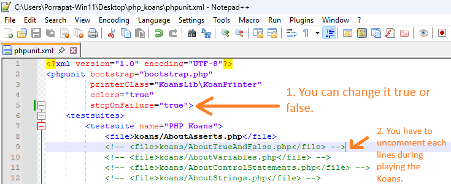
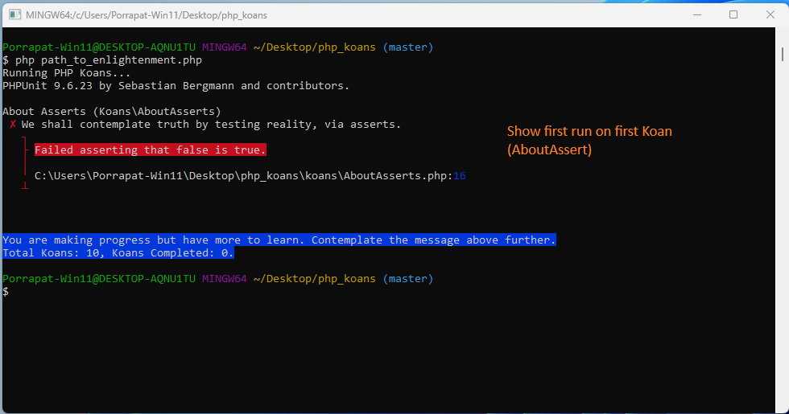
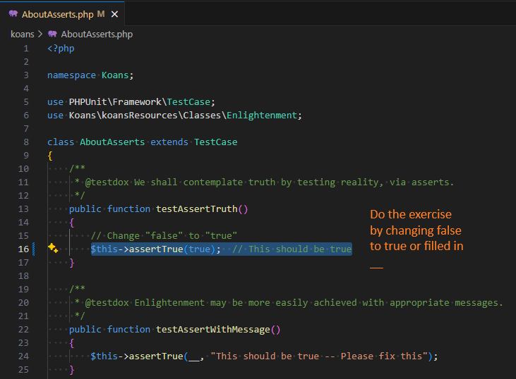
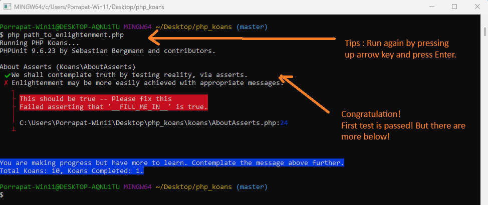

# PHP Koans

**PHP Koans** จะพาคุณเดินไปบน "เส้นทางแห่งปัญญา" เพื่อเรียนรู้ภาษา PHP  
เป้าหมายคือการเรียนรู้โครงสร้าง ภาษา ไวยากรณ์ ฟังก์ชัน และไลบรารีที่ใช้บ่อยใน PHP  
เรายังสอดแทรกวัฒนธรรมของนักพัฒนา โดยให้คุณเรียนรู้ผ่านการเขียนเทสต์ (Test)  
ซึ่งการเขียนเทสต์ไม่ใช่แค่สิ่งที่เราพูดถึงลอยๆ แต่เป็นสิ่งที่เราใช้จริงในชีวิตนักพัฒนา  
การเขียนเทสต์คือหัวใจสำคัญในการเรียนรู้และการทำสิ่งที่ยิ่งใหญ่ในโลกของ PHP

> _โปรเจกต์นี้ได้รับแรงบันดาลใจจาก Ruby Koans_

## 🌐 ภาษาที่มีให้เลือก

- 🇺🇸 [English](readme.md)
- 🇹🇭 [ภาษาไทย](readme_th.md)

## แรงบันดาลใจจากโปรเจกต์ต่าง ๆ

Koans นี้ได้รับแรงบันดาลใจมาจากโปรเจกต์เหล่านี้:

- [Ruby Koans](https://github.com/edgecase/ruby_koans)
- [Python Koans](https://github.com/gregmalcolm/python_koans)
- [PHP Koans (โดยคุณ Akoebbe)](https://github.com/akoebbe/php_koans.git)
- [PHP Koans (โดยคุณ IvanSolaDelgado)](https://github.com/540/php_koans.git)
- [Rustlings](https://github.com/rust-lang/rustlings)
- [Rust Koans (โดยคุณ crazymykl)](https://github.com/crazymykl/rust-koans)

---

## การติดตั้ง PHP

หากคุณยังไม่มี **PHP** และ **Composer** ติดตั้งไว้ในเครื่อง  
สามารถเข้าไปดูวิธีติดตั้งสำหรับแต่ละระบบปฏิบัติการได้ที่ [php.net](https://www.php.net)  
เพื่อใช้งาน Koans ได้ คุณต้องติดตั้ง **PHP** และ **Composer** ให้เรียบร้อยก่อน

ตรวจสอบว่าเครื่องคุณติดตั้งถูกต้องแล้วหรือยัง:

### บน Unix/Linux/macOS/Windows (ผ่าน terminal หรือ command line ใดก็ได้):

```bash
php -v
composer --version
```

### เริ่มต้นใช้งาน:

ให้ดูไฟล์ `phpunit.xml` แล้วทำการ uncomment โจทย์แต่ละข้อออก โดยเริ่มจาก `AboutAsserts`  
ภาพด้านล่างจะแสดงวิธีการทำแต่ละขั้นตอน

```bash
git clone https://github.com/Porrapat/php_koans.git
cd php_koans
composer install
php path_to_enlightenment.php
```

1. ติดตั้ง Koans



2. ตั้งค่า Koans



3. รัน Koans



4. แก้ Koans



5. ทบทวน Koans




### อื่น ๆ ที่ควรรู้

**ผู้เขียน**: ปรพัฒน์ เพชรดำรงค์สกุล <<porrapat.cpe20@gmail.com>>  
**ขับเคลื่อนโดย**: จีจี้ หรือที่รู้จักกันในชื่อ ChatGPT 😄  
**แจ้งปัญหาได้ที่**: [GitHub Issues](https://github.com/Porrapat/php_koans/issues)  
**ความต้องการของระบบ**: PHP 7.4.x ขึ้นไป และ Composer เวอร์ชันใดก็ได้ที่เป็นเวอร์ชันล่าสุด

---

### คำสั่งทางเลือกในการรัน Koans

```bash
composer test       # modern PHP style
php artisan test    # Laravel-style
php spark test      # CodeIgniter 4-style
```

### เคล็ดลับ – Watch ดูผล Koans อัตโนมัติ

แค่รันคำสั่งนี้ เบื้องหลังจะใช้ไฟล์ Binary ที่ Built จาก Rust เพื่อ Watch /koans /KoansLib /koansSolution path_to_enlightenment.php และ config_koans.txt

```bash
./watcher-Windows.exe           # For Windows
./watcher-macOS                 # For macOS
./watcher-Linux                 # For Linux
```

### สัญญาอนุญาต (License)

[](https://opensource.org/licenses/MIT)